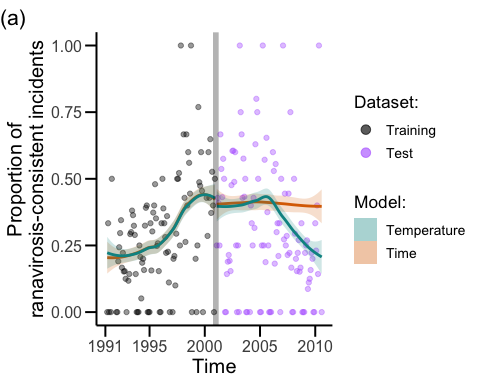

Stephen J. Price^1,2^, William T.M. Leung^2^, Chris Owen^1^, Rob Puschendorf^4^, Chris Sergeant^2^, Andrew A. Cunningham^2^, Francois Balloux^1§^, Trenton W.J. Garner^2§^, Richard A. Nichols^3§^  

^1^ UCL Genetics Institute, Darwin Building, Gower Street, London WC1E 6BT, UK  
^2^ Institute of Zoology, Zoological Society of London, Regents Park, London NW1 4RY, UK  
^3^ Queen Mary University of London, Mile End Road, London E1 4NS, UK  
^4^ School of Biological and Marine Sciences, University of Plymouth, Devon, PL4 8AA, UK

Corresponding author: Stephen J. Price (email: s.price@ucl.ac.uk)  

§ Balloux, Garner & Nichols should be considered joint senior author

Paper type: Primary Research Article

Running Title: Climate change impacts on a wildlife epidemic


# Abstract
The global trend of increasing environmental temperatures is often predicted to result in more severe disease epidemics. However, unambiguous evidence that temperature is a driver of epidemics is largely lacking, because it is demanding to demonstrate its role among the complex interactions between hosts, pathogens and their shared environment. Here we apply a three-pronged approach to understand the effects of temperature on ranavirus epidemics in common frogs, combining *in vitro*, *in vivo* and field studies. Each approach suggests that higher temperatures drive increasing severity of epidemics. In wild populations, ranavirosis incidents were more frequent and more severe at higher temperatures, and their frequency increased through a period of historic warming in the 1990s. Laboratory experiments using cell culture and whole animal models showed that higher temperature increased ranavirus propagation, disease incidence, and mortality rate. These results, combined with climate projections, predict severe ranavirosis outbreaks will occur over wider areas and an extended season, affecting larval recruitment. Since ranaviruses affect a variety of ectothermic hosts (amphibians, reptiles and fish), wider ecological damage is likely. Our three complementary lines of evidence present a clear case for direct environmental modulation of these epidemics and suggest management options to protect species from disease.  

**Keywords:** ranavirus, temperature, virulence, climate change, emerging infectious disease, host-pathogen interactions, common frog, *Rana temporaria*, amphibian population decline  

# 1 Introduction
Interactions between hosts, pathogens and their shared environment shape infectious disease outcomes, the timing of outbreaks, and the invasiveness of pathogens [@engeringPathogenHostEnvironment2013]. Climatic conditions at local and landscape scales represent a critical dimension of the host environment - affecting behavior (e.g. aggregation), stress and immunity - but can also directly affect pathogen (and vector) growth and survival [@altizerClimateChangeInfectious2013; @engeringPathogenHostEnvironment2013; @epsteinClimateChangeEmerging2001; @dobsonClimateChangeArctic2015; @grasslySeasonalInfectiousDisease2006]. As such, climatic conditions modulate host-pathogen interactions and operate on multiple timescales: acting annually in driving seasonality [@altizerSeasonalityDynamicsInfectious2006; @grasslySeasonalInfectiousDisease2006] as well as over longer time periods in determining responses to climate change [@dobsonClimateChangeArctic2015] and influencing the rate and pattern of invasions by emerging pathogens (e.g. @seimonUpwardRangeExtension2007).  

Despite this, invasion through pathogen range expansion and environmental change have frequently been viewed as mutually exclusive factors in explaining disease emergence, as indicated clearly in the framing and use of the “novel pathogen” (spread of an exotic pathogen through naïve populations) and “endemic pathogen” (emergence due to perturbations of interaction between hosts and native pathogens) hypotheses [@rachowiczNovelEndemicPathogen2005]. The “global panzootic” in amphibians caused by the fungal pathogen, *Batrachochytrium dendrobatidis*, serves as a prominent example of how climate change and pathogen range expansion have been pitted against one another as alternative explanations of declines [@bergerChytridiomycosisCausesAmphibian1998; @lipsRidingWaveReconciling2008; @poundsWidespreadAmphibianExtinctions2006]. There is strong evidence supporting the rapid international spread of a global panzootic lineage of *B. dendrobatidis* during the 20^th^ century [@farrerMultipleEmergencesGenetically2011; @ohanlonRecentAsianOrigin2018], but the proposed conflict between the two hypotheses now appears to have been reconciled in a framework that incorporates both as key drivers of emergence and outcomes, explaining observations of decline in regions where the impacts have been greatest [@cohenThermalMismatchHypothesis2017; @raffelDiseaseThermalAcclimation2013; @cohenInteractionClimateChange2018]. Thus, it seems likely that the previous mindset of treating environmental change and pathogen range expansion as conflicting has hampered understanding of the patterns of emergence and the focusing of mitigation efforts.  

Establishing a role for climate in disease emergence can be very challenging. Increasing environmental temperature is a key component of climate change, which is cited as a driver of infectious disease emergence and severity, but evidence for this is scarce and it is often difficult to discriminate between the effect of temperature and other aspects of climate [@harvellClimateWarmingDisease2002]. The direct and indirect influences of temperature on host-pathogen interactions [@altizerSeasonalityDynamicsInfectious2006; @clareClimateForcingEmerging2016; @garnerClimateChangeChytridiomycosis2011] and its nonlinear effects on incidence and severity [@boschClimateChangeOutbreaks2007; @raffelDiseaseThermalAcclimation2013; @walkerFactorsDrivingPathogenicity2010] represent considerable challenges to a better understanding of disease emergence. Most research effort in this area has focused on human diseases [@aguirreGlobalFactorsDriving2008], and vector-borne diseases (e.g. malaria, dengue, chikungunya) in particular [@harvellClimateWarmingDisease2002; @mcmichaelClimateChangeHuman2006].  

In the current study, we investigate the effect of temperature on the interaction between ranaviruses and their amphibian hosts, a host-pathogen system that offers the possibility of direct experimental manipulation, and a well characterized recent history of pathogen invasion into the UK [@priceReconstructingEmergenceLethal2016]. Ranaviruses are large double-stranded DNA viruses (family *Iridoviridae*) that can be highly pathogenic to ectothermic vertebrates [@grayEcologyPathologyAmphibian2009; @priceCollapseAmphibianCommunities2014; @rosaImpactAsynchronousEmergence2017]. Ranavirus infections of amphibians are notifiable to the World Organization for Animal Health due to their potential to cause severe disease outbreaks as well as the risks of international spread through trade [@schloegelMagnitudeUSTrade2009; @schloegelTwoAmphibianDiseases2010]. Ranavirus growth and virulence can be affected by temperature [@arielPropagationIsolationRanaviruses2009; @rojasInfluenceTemperatureRanavirus2005; @brandWaterTemperatureAffects2016; @bayleySusceptibilityEuropeanCommon2013] and environmental temperature is considered to be one possible explanation for observations of seasonality in outbreaks [@brunnerRanavirusEcologyEvolution2015]. Indeed, incidents of ranavirosis in frogs in the USA were recently shown to be uncoupled from a pulse in transmission or the density of susceptible hosts, and instead were coincident with temperature increases and developmental changes in frog larvae [@hallSeasonalDynamicsPotential2018].  

Ranaviruses are distributed globally but outbreaks of disease are extremely patchy - a pattern which is not yet understood. Some disease outbreaks have been shown to result from human translocations of ranavirus [@jancovichEvidenceEmergenceAmphibian2005; @piccoAmphibianCommerceLikely2008; @priceReconstructingEmergenceLethal2016], while other studies have found infections to be widespread at national scales without evidence for disease, which may reflect an historic association [@warneCoInfectionChytridFungus2016; @whitfieldInfectionCoinfectionAmphibian2013]. The seasonal patterns and the observations of a temperature effect in laboratory studies raise the possibility that environmental conditions could drive invasion success and routes in cases where ranaviruses are undergoing range expansion as well as climate change being a driver of disease emergence in regions where the associations between viruses and hosts are historic and widespread.  

In the UK, recurrent amphibian mass-mortality incidents caused by ranavirus have resulted in severe population declines of the common frog (*Rana temporaria*) [@teacherAssessingLongtermImpact2010]. Genetic evidence supports multiple pathogen introductions into the UK whilst spatiotemporal models suggest that ranavirus spread rapidly, facilitated by translocations of unspecified infectious materials by people [@hyattComparativeStudiesPiscine2000; @priceReconstructingEmergenceLethal2016]. Disease outbreaks are strongly seasonal, peaking in the summer months and appearing to mostly affect adult animals, contrasting with other regions where larvae or metamorphic animals are the worst-affected age-classes [@brunnerRanavirusEcologyEvolution2015]. However, the detectability of the main UK host, the common frog, is also strongly seasonal and there has been no previous attempts to explicitly control for host population density, host activity or observer effort in examining the periodicity of outbreaks [@cunninghamInvestigationsMassMortalities2001; @cunninghamPathologicalMicrobiologicalFindings1996; @teacherAssessingLongtermImpact2010].  

In this study, we investigated the role of temperature as a driver of disease outbreaks in common frogs infected with ranaviruses in the frog virus 3 (FV3) lineage through a combination of epidemiological modelling of a long-term study of disease in wild populations of UK common frogs [@cunninghamInvestigationsMassMortalities2001; @priceReconstructingEmergenceLethal2016], *in vitro* experiments involving manipulation of the host-pathogen environment and similar *in vivo* experiments using natural hosts. Our aims were to examine the role of temperature in shaping host-pathogen interactions to address whether it 1) has been a factor explaining the pattern of invasion which can be used to predict future changes in epidemiology under projections of climate change, and 2) can explain the observed seasonal patterns in disease occurrence and the contrast in affected host age-class compared to other temperate regions experiencing amphibian mortality incidents due to the same type of ranavirus.  

# 2 Materials and Methods
## 2.1 Temperature as a predictor of frog mortality and incident severity
**Temperature-dependence of ranavirus incidence:** We used data from the Frog Mortality Project (FMP), a flagship citizen science project which has been collating reports of amphibian mortality incidents from members of the UK public for over twenty-five years [@priceReconstructingEmergenceLethal2016] to study disease occurrence in wild populations. The FMP dataset has been reliably filtered for incidents of ranavirosis previously [@northAnthropogenicEcologicalDrivers2015; @priceReconstructingEmergenceLethal2016; @teacherAssessingLongtermImpact2010]. In this study, the same criteria as @cunninghamInvestigationsMassMortalities2001 and @priceReconstructingEmergenceLethal2016 (the presence of indicative signs of disease [‘ulceration’, ‘red spots on the body’, and ‘limb necrosis/loss of digits’; see Supporting information Appendix S1 and Figure S1] and a minimum of five dead animals) were used to create a binary variable describing the ranavirus status of each incident. The seasonal detectability of amphibians was controlled for indirectly through the inclusion of mortality incidents caused by factors other than ranavirosis as previously [@priceReconstructingEmergenceLethal2016]. Data on the timing of the onset of mortality (available at the resolution of month only) and the incident location were used to download the monthly average of the daily maximum temperature for each incident from the Met Office UKCP09 dataset [@metofficeUKCP09MetOffice2017] (further details in Supporting information Appendix S2).  

Factors affecting ranavirus incidence were investigated using a standard logistic regression model incorporating variables describing the environment (temperature), pond (volume, shading, and presence of marginal and floating vegetation), other aquatic vertebrate species present in addition to common frogs (toads, newts, fish) and geographic region (government office region) as predictors of ranavirus status (Model 1) fitted with the R function *glm2* [@marschnerGlm2FittingGeneralized2011; @rcoreteamLanguageEnvironmentStatistical2017]. To explore the relationship between temperature and the probability of a ranavirus-positive observation further, it was modelled as a sigmoid (logistic) transition between an upper and lower mean frequency. The four parameters of the curve (upper and lower limits, the location and the slope of the transition) were fitted using the *mle2* function in the R package, *bbmle* [@bolkerBbmleToolsGeneral2017; @rcoreteamLanguageEnvironmentStatistical2017]. Starting values for the *mle2* algorithm were obtained for slope and location (intercept), using the *glm2* function with a bespoke link function for binomial data (Data S2). A confidence interval around the fitted line was generated using the delta method to compute variance of a function with the *emdbook* package [@bolkerEcologicalModelsData2008; @bolkerEmdbookEcologicalModels2016]. The model was compared using Akaike’s Information Criterion (AIC) to a standard logistic curve (a simplified version of Model 1 with only temperature terms retained as predictors).  

**Effect of increased temperature on the severity of disease incidents:** In order to analyze the effect of temperature on disease incident severity, which was calculated as the proportion of the population that died and therefore included the total number of dead animals, the dataset was filtered using only signs of disease as criteria for differentiating between incidents caused by ranavirus and those caused by other factors. Incidents were considered ranavirosis-consistent if any two of the three indicative signs of disease used above were reported. The total number of dead frogs and the number of surviving frogs (estimated by reporters) were combined as an estimate of the proportion of the population that died and used as the response variable term in a generalized linear model using the quasibinomial family to account for overdispersion in the data [@crawleyBook2013]. The average local maximum temperature for the month of onset of mortality and the predicted ranavirus status, as well as the interaction between main effects, were used as predictors of severity. This basic model was also extended by incorporating these same terms as well as other variables describing the pond environment (presence of other species and physical characteristics of ponds).  

**Temperature preceding ranavirus outbreaks with precise timestamps:** We previously screened a UK amphibian and reptile tissue archive for ranavirus and returned a database of mortality incidents for which the presence of ranavirus was established using molecular diagnostic methods [@priceScreeningLongtermSample2017]. After filtering for incidents with a precise georeference (postcodes or grid references) and timestamp (date found, submitted, or examined if a post-mortem examination was conducted on receipt, which were each assumed to approximate closely to the day of death due to the rapid decomposition of amphibian carcasses), this dataset contained a total of 197 incidents, for which ranavirus had been detected from  31. All incidents were overlaid on the UK grid of 5 x 5 km squares and the maximum daily temperatures for the date matching the timestamp and the 50 days prior to the death(s) were extracted from plain text data files in the UKCP09 dataset [@metofficeUKCP09MetOffice2017b], which were downloaded using the R package *Rcurl* [@templelangRCurlGeneralNetwork2018; @priceUsingDownloadCEDA2018].  

Ranavirus status was used as the response variable in a series of logistic regression analyses (generalized linear models using the binomial family and the logit link function) with the average maximum daily temperature in the week preceding the mortality incident or the number of consecutive days in the previous seven where temperature exceeded 16°C as predictors. These models were also run with region (Government Office Region) or latitude as an additional predictor to further control for any effect of spatial variation in temperature. As above, seasonal variation in the detectability of amphibians was controlled for by inclusion of mortality incidents caused by factors other than ranavirosis.  

**Effects of historic warming and seasonality:** To check whether prior warming (over the time course of the dataset; 1991-2010) had altered the rate of ranavirus incidents and to assess seasonality in the data, we first decomposed the annual signal and trend across years in the time series of temperatures and rates of ranavirosis incidents. The mean of the average daily maximum temperature during the month of onset of mortality incidents from all reports in the FMP dataset (1991-2010) was calculated for each month with reports, as well as the numbers of reports that were consistent or otherwise with ranavirosis. Generalized Additive Mixed Models (GAMM; R function *gamm*; package *mgcv* [@woodGeneralizedAdditiveModels2017; @woodStableEfficientMultiple2004; @woodThinPlateRegression2003]) were used to fit smooth splines to both the within-year (seasonal; cyclic cubic regression spline) and across-year (cubic regression spline) patterns and autocorrelation structures (of order one) were used to model residual correlation within years. The number of ranavirosis incidents as a proportion of total reports was then modeled as a function of the seasonal trend (smoothed with a cubic regression spline as above), the trend in temperature across years (predicted using the GAMM above and smoothed with a cubic regression spline) and time using a Generalized Additive Model (GAM) and the binomial family with logit link function (function *gam*; package *mgcv*).  

Model assumptions were verified by plotting residuals against fitted values and against each covariate in the model (function *gam.check*; package *mgcv*). Autocorrelation among residuals was assessed using the *acf* function in the *stats* R package [@venablesModernAppliedStatistics2002]. Model predictions and residuals were extracted and visualized using functions in the R packages, *visreg* and *ggplot2* [@brehenyVisualizationRegressionModels2013; @wickhamGgplot2ElegantGraphics2016]. The predictive power of the model incorporating the across-year temperature trend was then assessed by comparison to a model containing the temporal trend in the rate of ranavirus incidents by dividing the dataset into two training and test sets (taking half and three-quarters of the data for training respectively). GAMs incorporating the smoothed seasonal trend and either a smoothed (across-year) time trend *or* the smoothed temperature trend were fitted using the training datasets and compared in terms of their ability to predict patterns in the test datasets.  

## 2.2 Virus growth *in vitro*
To investigate the effect of temperature on viral growth, two UK isolates of FV3 [RUK11, isolated from the kidney of a diseased common frog that died with systemic hemorrhages in Middlesex in 1992, and RUK13, isolated from the skin of a diseased common frog that died with skin ulceration in Suffolk in 1995 [@cunninghamInvestigationsMassMortalities2001]] were grown at a range of temperatures in two cell lines (epithelioma papulosum cyprini [EPC, derived from the fathead minnow fish, *Pimephales promelas* [@wintonCurrentLineagesEpithelioma2010]; ECACC 93120820] and the iguana heart reptile line [IgH2; ECACC 90030804]). Cells were grown on 96 well plates until more than 90% confluent and then inoculated with virus in a ten-fold dilution series ranging from an estimated multiplicity of infection of approximately 2 x 10^-6^ to 2 x 10^3^ (five wells per dilution with an additional one well per dilution receiving a sham exposure of cell culture media only as a negative control). Titers of viral isolate stocks were equalized by reference to qPCR scores (following @leungQuantitativePCRBasedMethod2017). Plates were incubated at six temperatures (10, 14, 18, 22, 26, and 30°C) and monitored daily for cytopathic effect (plaques in the cell layer). After six days, plates were scored for viral growth by counting the number of replicates at each dilution where cytopathic effect was evident and calculating the Tissue Culture 50% Infective Dose (TCID50) using the method of @reedSimpleMethodEstimating1938. The effects of temperature and cell line on viral growth (the mean titers of the two isolates of each type) were analyzed using a linear model in R.  

## 2.3 *In vivo* assessment of effect of temperature on virulence
To investigate whether an effect of temperature on *in vitro* viral growth was reflected in altered virulence *in vivo*, 60 overwintered common frog metamorphs (*R. temporaria*) were randomly allocated to one of six treatments (10 animals per treatment): three exposure treatments (sham, RUK11, RUK13) crossed with two temperatures (20°C [“low”] and 27°C [“high”]). Temperature was maintained by placing five individually-housed frogs selected at random from each of the three exposure treatments into one of four climate-controlled chambers constructed from polystyrene boxes - two held at 20°C and two held at 27°C (Figure S2; see Supporting information Appendix S3 for a comprehensive description of the set up). RUK13 was used at a titer of 1.58 x 10^5^ TCID50 mL^-1^ and RUK11 at a titer of 1.58 x 10^7^ TCID50 mL^-1^ (see Supporting information Appendix S3 for details of preparation of inocula and exposure methods).  

Individuals reaching endpoints (either gross signs of hemorrhaging or ulceration; Figure S1) and all surviving individuals at the end of the experiment (day eight post-exposure) were euthanized following a schedule 1 method for amphibians. The number of hours post-exposure that animals were found dead or at endpoints was recorded for survival analysis. Survival data were analyzed by fitting a mixed-effects Cox proportional hazards regression model in R using the *coxme* package [@therneauCoxmeMixedEffects2018] with exposure and temperature as fixed effects and the climate-controlled chamber as a random effect to account for pseudo replication due to placement of individual experimental units inside the four climate-controlled chambers. Model coefficients were visualized using *forestplot* [@gordonForestplotAdvancedForest2017].  

A second *in vivo* experiment was performed in the same host species, using one ranavirus isolate (RUK13) and a single temperature (20°C), but two exposure doses (“low” and “high”; detailed methods in Supporting Information Appendix S1). The effects of temperature and dose on disease progression and survival were compared.  

## 2.4 Effect of projected climate change on timing of ranavirus outbreaks
Baseline temperature data were generated by calculating the mean daily maximum temperature for each calendar month for the period 1991-2010 (the same period covered by our dataset of reported frog mortality incidents) for each 5 x 5 km grid square used by the Met Office UKCP09 project [@metofficeUKCP09MetOffice2017]. Probabilities of mean daily maximum temperature exceeding 16°C for calendar months during the period 2070-2099 under the Intergovernmental Panel on Climate Change (IPCC) B1 (“low”), A1B (“medium”) and A1FI (“high”) future emissions scenarios [@ipccSpecialReportEmissions2000] were downloaded for a grid of 25 x 25km squares at UK scale using the UK Climate Projections user interface [@jenkinsUKClimateProjections2009].  

# 3 Results
## 3.1 Effect of temperature on disease occurrence and severity in the wild


```
## Start:  AIC=2985.65
## rv ~ maxt + log_pvol + I(maxt^2) + Toads + Newts + Fish + gor + 
##     shading_pa + float_pa + margin_pa
## 
##              Df Deviance    AIC     LRT  Pr(>Chi)    
## - float_pa    1   2945.7 2983.7  0.0462 0.8297243    
## - gor        10   2964.6 2984.6 18.9550 0.0408385 *  
## - Toads       1   2946.6 2984.6  0.9739 0.3237121    
## - log_pvol    1   2947.4 2985.4  1.7534 0.1854466    
## - margin_pa   1   2947.6 2985.6  1.9012 0.1679431    
## <none>            2945.7 2985.7                      
## - Fish        1   2949.5 2987.5  3.8236 0.0505362 .  
## - Newts       1   2950.4 2988.4  4.7746 0.0288818 *  
## - shading_pa  1   2950.5 2988.5  4.8742 0.0272606 *  
## - I(maxt^2)   1   2957.6 2995.6 11.9868 0.0005358 ***
## - maxt        1   2962.8 3000.8 17.1067 3.534e-05 ***
## ---
## Signif. codes:  0 '***' 0.001 '**' 0.01 '*' 0.05 '.' 0.1 ' ' 1
## 
## Step:  AIC=2983.7
## rv ~ maxt + log_pvol + I(maxt^2) + Toads + Newts + Fish + gor + 
##     shading_pa + margin_pa
## 
##              Df Deviance    AIC     LRT  Pr(>Chi)    
## - Toads       1   2946.7 2982.7  0.9690 0.3249327    
## - gor        10   2964.7 2982.7 19.0381 0.0397809 *  
## - log_pvol    1   2947.5 2983.5  1.7584 0.1848235    
## <none>            2945.7 2983.7                      
## - margin_pa   1   2948.0 2984.0  2.2643 0.1323881    
## - Fish        1   2949.5 2985.5  3.8309 0.0503170 .  
## + float_pa    1   2945.7 2985.7  0.0462 0.8297243    
## - shading_pa  1   2950.5 2986.5  4.8291 0.0279830 *  
## - Newts       1   2950.6 2986.6  4.8726 0.0272862 *  
## - I(maxt^2)   1   2957.7 2993.7 11.9603 0.0005435 ***
## - maxt        1   2962.8 2998.8 17.0848 3.575e-05 ***
## ---
## Signif. codes:  0 '***' 0.001 '**' 0.01 '*' 0.05 '.' 0.1 ' ' 1
## 
## Step:  AIC=2982.67
## rv ~ maxt + log_pvol + I(maxt^2) + Newts + Fish + gor + shading_pa + 
##     margin_pa
## 
##              Df Deviance    AIC     LRT  Pr(>Chi)    
## - gor        10   2965.6 2981.6 18.9654  0.040705 *  
## - log_pvol    1   2948.6 2982.6  1.9640  0.161081    
## <none>            2946.7 2982.7                      
## - margin_pa   1   2949.0 2983.0  2.2957  0.129736    
## + Toads       1   2945.7 2983.7  0.9690  0.324933    
## + float_pa    1   2946.6 2984.6  0.0413  0.838868    
## - Fish        1   2950.8 2984.8  4.1308  0.042110 *  
## - shading_pa  1   2951.3 2985.3  4.6625  0.030828 *  
## - Newts       1   2952.3 2986.3  5.6177  0.017780 *  
## - I(maxt^2)   1   2958.5 2992.5 11.8683  0.000571 ***
## - maxt        1   2963.6 2997.6 16.9453 3.847e-05 ***
## ---
## Signif. codes:  0 '***' 0.001 '**' 0.01 '*' 0.05 '.' 0.1 ' ' 1
## 
## Step:  AIC=2981.63
## rv ~ maxt + log_pvol + I(maxt^2) + Newts + Fish + shading_pa + 
##     margin_pa
## 
##              Df Deviance    AIC     LRT  Pr(>Chi)    
## - log_pvol    1   2967.2 2981.2  1.6095 0.2045565    
## <none>            2965.6 2981.6                      
## - margin_pa   1   2967.8 2981.8  2.1935 0.1385927    
## + gor        10   2946.7 2982.7 18.9654 0.0407045 *  
## + Toads       1   2964.7 2982.7  0.8962 0.3437925    
## - shading_pa  1   2969.4 2983.4  3.7598 0.0524977 .  
## + float_pa    1   2965.5 2983.5  0.1178 0.7313926    
## - Fish        1   2970.1 2984.1  4.4617 0.0346626 *  
## - Newts       1   2972.4 2986.4  6.7967 0.0091328 ** 
## - I(maxt^2)   1   2979.2 2993.2 13.5610 0.0002309 ***
## - maxt        1   2985.3 2999.3 19.6410 9.344e-06 ***
## ---
## Signif. codes:  0 '***' 0.001 '**' 0.01 '*' 0.05 '.' 0.1 ' ' 1
## 
## Step:  AIC=2981.24
## rv ~ maxt + I(maxt^2) + Newts + Fish + shading_pa + margin_pa
## 
##              Df Deviance    AIC     LRT  Pr(>Chi)    
## <none>            2967.2 2981.2                      
## + log_pvol    1   2965.6 2981.6  1.6095 0.2045565    
## - margin_pa   1   2969.8 2981.8  2.5531 0.1100787    
## + Toads       1   2966.2 2982.2  1.0828 0.2980734    
## + gor        10   2948.6 2982.6 18.6109 0.0454927 *  
## + float_pa    1   2967.1 2983.1  0.1270 0.7216001    
## - shading_pa  1   2971.6 2983.6  4.3266 0.0375217 *  
## - Fish        1   2973.7 2985.7  6.4235 0.0112618 *  
## - Newts       1   2975.1 2987.1  7.8921 0.0049651 ** 
## - I(maxt^2)   1   2980.4 2992.4 13.1647 0.0002853 ***
## - maxt        1   2986.4 2998.4 19.1123 1.233e-05 ***
## ---
## Signif. codes:  0 '***' 0.001 '**' 0.01 '*' 0.05 '.' 0.1 ' ' 1
```

The finalized FMP dataset used in this study contained 4385 unique records, of which 1497 were classed as ranavirosis-consistent. The logistic model (Model 1) revealed a highly significant, non-linear effect of temperature on the proportion of ranavirosis-consistent incidents observed (Table S1). The minimal adequate model also retained newts, fish and shading: the presence of either type of animal in ponds increased the proportion of ranavirosis-consistent incidents observed whilst shading reduced this proportion (Table S1). To explore the relationship with temperature further, a model with a transition between an upper and lower frequency was fitted (Model 2), which significantly improved the fit to the data compared to a simplified version of Model 1 comprising only the terms describing the non-linear relationship with temperature (AIC scores were 5565 and 5576 respectively). Model 2 shows a step-change: below approximately 16°C, 25.1% of incidents were ranavirosis-consistent, rising to 38.5% after the temperature threshold was crossed (Figure 1a). The difference between incidents that were ranavirosis-consistent and the remainder (‘non-ranavirus’) is also apparent in the distribution of temperature records: the non-ranavirus category being strongly bimodal with peaks at both low and high temperature, whereas most of the ranavirosis-consistent incidents were reported at higher temperatures with few outliers at much lower temperatures (Figure S3).  


Temperature was again a highly significant predictor of ranavirus status when the records with precise timestamps and confirmed ranavirus-positive status were analyzed. This more precise information about timing enabled a fine-scale examination of the effect of temperature in the days preceding incidents. The average temperature in the seven days preceding incidents was a significant predictor of ranavirus status (p = $1.18\times 10^{-4}$; residual deviance of model = 154.2 on 195 degrees of freedom; Figure 1b), with each 1°C increase in temperature increasing the odds that incidents were caused by ranavirus by 20%. The temperature threshold where the proportion of ranavirus incidents increased sharply in the analysis of the full FMP dataset was approximately 16°C. A second model - with the number of consecutive days where the daily maximum temperature in the week preceding incidents exceeded 16°C as a predictor - also indicated that warmer temperatures were a good predictor of ranavirus status (p = $2.27\times 10^{-5}$; residual deviance of model = 151 on 195 degrees of freedom; Figure 1c): each additional warm day raised the odds that incidents were caused by ranavirus by 33%. The 16°C threshold model had a slightly lower AIC score than the model using the average temperature as a predictor (155 compared to 158).  

The FMP database contains data on the severity of outbreaks (the estimated proportion of the frog population that died) for the years 1991-2000. After removing records with missing values, we produced a dataset for investigating severity that contained 2667 records, of which 427 incidents were classified as ranavirosis-consistent. In a simple logistic model of severity with ranavirus status, average daily maximum temperature for the month of onset of mortality, and their interaction as predictors, all three terms were significant predictors and retained in the minimal adequate model. Temperature explained the most deviance with each 1°C increase in temperature leading to a 2.8% increase in the proportion of the population that died (p = $1.61\times 10^{-12}$). There was a significant interaction between the two main effects as a consequence of the different effect of ranavirus status on the relationship between temperature and the proportion dead (p = 0.001): at low temperatures, the severity of ranavirosis-consistent incidents was slightly lower than for other types of incident but at higher temperatures it was the ranavirosis-consistent incidents that were more severe (Figure 1d; Supporting information Figure S4). Attempting to incorporate time (the year that mortality incidents began) did not result in an extension of the minimal adequate model.  

The effects of other covariates previously identified as having an influence on the occurrence or severity of ranavirosis in UK common frogs [@northAnthropogenicEcologicalDrivers2015] were also explored using a more complex model containing ranavirus status, temperature, log-transformed pond volume, the interactions of the three, shading around ponds, the amount of both the marginal and floating vegetation (“none/little” or “lots”), the presence of toads, the presence of newts, the presence of fish, and the region. After model simplification, the minimal adequate model retained all three terms from the simple model but there were also significant effects of the presence of toads, the presence of fish, shading, pond volume (non-linear), marginal vegetation and region (Table S2). Toads reduced the severity of mortality incidents whilst the presence of fish increased severity (Supporting information Figure S5) as found previously [@northAnthropogenicEcologicalDrivers2015]. Shading and marginal vegetation decreased the severity of incidents. Notwithstanding, and irrespective of which covariate was considered, the effect of increasing temperature increased the severity of disease. This is perhaps best illustrated by the effects of pond shading, where increasing the amount of shading (and, presumably, decreasing the maximum temperatures that frogs would have been exposed to) was associated with reduced severity of ranavirosis and a reduction in the disparity in the severity of incidents between ranavirosis-consistent and non-ranavirus incidents (Figure 1e).  

<!-- -->

**Figure 1. Warm temperatures increased the frequency and severity of incidents of ranavirosis involving wild common frog populations of the United Kingdom.** (a) The effect of temperature on the proportion of citizen science reports of frog mortality that were classified as ranavirosis-consistent. The line represents the fitted maximum likelihood model of a logistic transition between a lower and upper frequency. The shaded area around the line represents the 95% confidence interval, calculated using the delta method. Points represent the observed data, grouped in windows containing equal numbers of records. (b-c) Temperature in the week preceding frog mortality incidents confirmed by molecular methods predicted ranavirus status (“Positive” or “Negative”). (b) Average daily maximum temperature in the seven days preceding incidents by ranavirus status. (c) The number of days in the week preceding mortality incidents where the daily maximum temperature exceeded 16°C by ranavirus status. (d) The severity of frog mortality incidents (estimated proportion of population that died) was consistently greater at higher temperatures, particularly in the case of ranavirosis-consistent incidents (orange). The plot shows fitted lines (and 95% confidence intervals) from a generalized linear model (quasibinomial regression) of severity as a function of ranavirus status and temperature (average daily maximum temperature for the month of onset of mortality incidents). (e) Large amounts of shading around ponds reduced the severity of ranavirosis-consistent mortality incidents (orange) but had no effect on other incidents (green). In panels (b) and (e), boxplots represent lower quartile, median, upper quartile and interquartile range (upper quartile - lower quartile; central 50% of the data); whiskers extend to the most extreme data point which is no more than 1.5 times the interquartile range from the box; outliers shown as individual points where relevant.  

## 3.2 Historic climate change and seasonality


Temperatures in our study region varied across years, showing a warming trend that peaked in 2002 before cooling up to 2010, as well as showing marked seasonality (GAM component of GAMM: R^2^ = 0.93; Table S3). The proportion of ranavirosis incidents followed a remarkably similar pattern, in terms of the strong seasonality and the trend across years (GAM component of GAMM: R^2^ = 0.36; Table S4; Figure 2a). The across-year temperature trend was a highly significant predictor of the rate of ranavirus incidents (GAM: effective degrees of freedom (edf) of smoothed term = 6.65, p = $4.61\times 10^{-26}$), explaining the pattern of increasing rates which peaked in 2001, with the full model explaining approximately half the deviance (R^2^ = 0.48; Figure 2; Table S5). Model validation indicated conformity to assumptions. The temperature model, when trained on subsets of the data, predicted trends in test datasets effectively in contrast to models incorporating only the across-year trend in ranavirosis rates, which showed no predictive power (Supporting information Figure S6). Temperature showed a strong seasonal pattern which was reflected in the pattern of ranavirosis incidents where seasonality was also marked (GAM: edf = 7.65, p = $2.45\times 10^{-13}$; Figure 2c), raising the possibility that another seasonal factor - correlated with temperature - could have driven ranavirus outbreaks. However, the association between temperature and the rate of ranavirus incidents across years suggests that temperature is driving the rate of disease incidents in the long term and may also drive the seasonality, since both a correlated seasonal factor and a correlated non-seasonal factor acting across years would otherwise be required to explain the observed patterns. Overall, after accounting for the effect of temperature, there was a small but significant decrease in the proportion of ranavirosis incidents between 1991 and 2010 (GAM: coefficient = -0.00315 [unit of time was months], p = $2.31\times 10^{-5}$; Figure 2d).  

<!-- -->

**Figure 2. Effect of historic climate and seasonality on rate of ranavirosis incidents.** (a) comparison of smoothed trends in temperature and rates of ranavirosis incidents (on standardized scale [0-1]) over period of dataset (1991-2010). (b-d) Effect of predictors of the rate of ranavirosis incidents (from generalized additive model) against residuals: Smoothed change in rate of ranavirus incidents with temperature (b), smoothed seasonal change in rate of ranavirosis incidents (c), and change in rate of ranavirosis incidents over time (d). Shaded areas represent 95% confidence intervals.  

## 3.3 *In vitro* assessment of viral growth rates and *in vivo* tests of virulence


We examined *in vitro* viral growth using two UK isolates of FV3 (RUK11 and RUK13; see methods for detailed descriptions of isolates) and two cell lines. Each isolate was incubated at a range of temperatures up to 30°C with each cell line, but regardless of cell line or isolate, increasing temperature resulted in exponentially increased rates of plaque formation (Figure 3). A linear model of log viral titers against temperature, cell line and their interaction revealed significant effects of temperature (coefficient = 1.23, p = 0) and host cell line (IgH2 compared to EPC, coef = -8.64, p = 0) but no interaction (analysis of variance, comparing model with interaction term to a model with main effects only: F~df\ =\ 1~ = 0.0047, p = 0.95), indicating the overall effect of temperature was independent of the host environment.  

<!-- -->

**Figure 3. Effect of environmental temperature on growth of UK *Frog virus 3* (FV3) *in vitro*.** Observed data (points) and predictions from linear model (lines with 95% confidence interval shaded) of FV3 growth at a range of environmental temperatures in fish (EPC; solid line) and reptile (IgH2; dashed line) cells. Growth was measured using the TCID50 method and is shown on a log scale. An increase in temperature of 1°C results in more than a doubling of viral growth (2.34 times).  


The effect of temperature on the response of common frogs to viral exposure was assessed in order to validate results from cell culture models *in vivo*. Temperature was a highly significant predictor of survival: 20 of 60 animals died or were euthanized on reaching humane endpoints, of which 14 were from high temperature treatments and six were from low temperature treatments (Figure 4a). Overall there was a 5.33 times higher risk of death in the high temperature treatments (p = 0.005; Figure 4b). Titers of viral inoculates were not equalized between isolates. All individuals exposed to RUK11 (at a high dose) and maintained at high temperature died or reached endpoint by the eighth day post-exposure compared to six of ten individuals maintained at low temperature (Figure 4a). Of the animals exposed to RUK13 (at a relatively low dose compared to RUK11), three individuals died or reached endpoint in the high temperature treatment compared with none at the low temperature. There was also a significant effect of exposure treatment: the expected hazard of animals exposed to RUK11 was 41.6 times higher than animals receiving a sham exposure (p = 0.0004). These results are largely in line with a study examining survival of common frog tadpoles exposed to a North American isolate of FV3, which showed that mortality was increased at 20°C compared to 15°C [@bayleySusceptibilityEuropeanCommon2013].  

The second *in vivo* experiment examining the effect of dose on disease outcome and progression in juvenile common frogs (Supporting Information Appendix S1) complements the findings of the *in vivo* temperature experiment. The dose experiment suggests that a viral load threshold exists which must be crossed before gross signs of disease develop. We found the outcome and presentation of disease as well as the viral quantity in tissues at death to be largely independent of dose: all animals exposed to either low or high viral doses died, presented with the same set of signs (Figure S1 & S7), and had similar quantities of virus in their tissues at death (Figure S8a). However, the onset and progression of disease was delayed at low dose (the development of disease and death both occurred significantly later; Figure S7) reflecting the lower viral loads of individuals (measured by swabbing animals after infection; Figure S8b) given this treatment. Also, viral loads of dead individuals were greater than those of live individuals (both when repeated-measures from the same individuals were compared [Figure S8c] and when individuals that were euthanized part-way through the experiment were compared to those that died [Figure S8d]). These results all suggest that elevated viral loads lead to the onset of disease and that the viral capacity to cross a threshold concentration is a more important determinant of whether disease develops than the initial dose. It seems likely that higher temperature and higher initial dose each serve as ways to reach this putative threshold for disease sooner - either through more rapid viral growth or a greater initial intensity of infection respectively - and explain the delays and/or reductions in observations of severe outcomes in the other respective treatments (low temperature or low dose).  

<!-- --><!-- -->

**Figure 4. Effect of temperature and ranavirus exposure on survival of common frogs.** The proportion of surviving animals through time plotted for each of six treatments (n=10 frogs per treatment); three exposure treatments (Sham, RUK11, RUK13) at each of two temperatures (20°C [“low”] or 27°C [“high”]). (a) Kaplan-Meier survival plot. (b) Forest plot of coefficients (± standard error) from a mixed effects Cox Proportional Hazards model of survival in response to exposure (“Sham” as the reference level) and temperature (“Low” as the reference level) treatments.  

## 3.4 Impact of future climate on timing of outbreaks
The UK climate is expected to warm considerably over the remainder of the century [@jenkinsUKClimateProjections2009; @chenGlobalSurfaceWarming2018]. A warmer climate would expand the geographic area where environmental conditions are likely to be suitable for severe incidents of ranavirosis (average monthly maximum daily temperatures exceeding 16°C). For example, the suitable geographic area for ranavirosis occurrence in May is projected to increase by 134% by 2070 under a high emissions scenario compared to the historic baseline and by 84% under a low emissions scenario (Figure 5). The projected changes in UK temperatures also will extend the duration of the “disease season”, creating favorable conditions for disease during the spring and autumn as well as in the summer. Temperatures are likely to become more suitable for severe outbreaks in a large part of England in April under a high emissions scenario and in October under any of the range of IPCC scenarios investigated. These are months that we expect to have experienced limited incidence and severity of ranavirosis previously, but temperatures are projected to change to such a degree that this limitation will be removed for large areas of the UK (Figure 5).  

<!-- -->

**Figure 5. Projected shifts in geographic extent and the temporal window of ambient temperatures high enough to increase the risk and severity of ranavirosis incidents in the UK under different emissions scenarios.** (a) Past climate - orange regions are those where the average monthly temperatures (daily maximum temperature) in the UK (5 x 5 km grid squares) exceeded 16°C for the period 1991-2010. (b-d) Future climate - orange regions are those where the projected average monthly daily maximum temperatures in the UK (25 x 25 km grid squares) have a greater than 50% probability of exceeding 16°C under a range of future emissions scenarios for the period 2070-2099: (b) Intergovernmental Panel on Climate Change (IPCC) scenario B1 (low), (c) scenario A1B (medium) and (d) scenario A1FI (high).  

## 4 Discussion
By combining the results of laboratory experiments with the analysis of two types of epidemiological dataset relating to disease outbreaks in wild amphibian populations, we have revealed a pattern of remarkably consistent evidence supporting a substantial effect of temperature on ranavirus disease dynamics. Temperature predicts both the incidence and severity of disease outbreaks through higher temperatures increasing viral growth which, in turn, manifests as an increased rate of disease occurrence in both experimental and wild frog populations. The use of *in vitro* and *in vivo* studies in combination with modeling of field datasets serves as a ‘triangulation’ process [@plowrightCausalInferenceDisease2008] and strongly suggests a causal link between temperature and disease occurrence in this system. Temperature is, of course, correlated with a multitude of other factors that may be considered alternative or additional drivers of disease outbreaks, but our findings of an association between temperature and disease incidents at two different timescales (within and across years) and the triangulation process both support the conclusion that temperature has a causal effect on ranavirus disease occurrence.  

Our results are consistent with an historic effect of climate on the rate and timing of ranavirus incidents and suggest that the invasiveness of this introduced pathogen may have been facilitated, but also restricted, by the suitability of local climate. We have previously shown that ranavirus was introduced to the UK and spread rapidly in England (Price et al. 2016). The small overall decrease in the rate of disease incidents observed over the twenty years of data analyzed (Figure 2d) may be due to fewer opportunities for spread arising from a more complete colonization of the suitable range or might be credited to attempts to limit the risk of translocations through advice disseminated in the media (e.g. @bbcWarningMovingFrogspawn2008; @priceReconstructingEmergenceLethal2016). Alternatively, the severe impacts of recurrent ranavirus outbreaks - previously shown to have caused declines of common frogs in South-East England [@teacherAssessingLongtermImpact2010] - may have led to the extirpation of populations or reduced their size/density to the point where transmission no longer occurred, or disease outbreaks were no longer detectable.  

Climate projections show how climate change will likely play a role in shaping future ranavirus disease dynamics in UK common frogs, altering both the geographic extent and the length of the temporal window of heightened disease risk and severity. The potential impacts of climate warming on disease ecology, therefore, could have critical ramifications for the continued survival of amphibian populations across the UK. Although it is challenging to detect disease and mortality in larval amphibians, all evidence points to adult common frogs as the major life history stage and species affected by ranavirosis in the wild in the UK [@cunninghamInvestigationsMassMortalities2001; @duffusRanavirusEcologyCommon2009; @priceScreeningLongtermSample2017]. This observation is intriguing since larval forms are usually more affected by FV3 elsewhere in the world and common frog larvae have been shown to be highly susceptible to wild-type ranaviruses in the laboratory [@duffusExperimentalEvidenceSupport2014; @duffusInvestigationsLifeHistory2013; @grayEcologyPathologyAmphibian2009].  

Our findings suggest that temperature could be an important determinant of the partitioning of disease among life-history stages, with common frog larvae metamorphosing before pond water reaches a temperature high enough to trigger outbreaks of ranavirosis. This situation could be altered as the climate warms and the disease season is lengthened. Shifting the timing of frog disease outbreaks will alter the life history stages at risk. If common frog tadpoles become affected, the abundance of susceptible hosts will be increased with concomitant impacts on the ranavirus basic reproductive number (R~0~) [@altizerSeasonalityDynamicsInfectious2006]; i.e. the dynamics of outbreaks will be fundamentally changed, making predictions of their impacts more challenging. Whilst the breeding phenology of some UK amphibian species has altered in response to climatic changes, common frog breeding may not respond to increasing absolute temperatures [@beebeeAmphibianBreedingClimate1995], so any compensatory change in host behavior may be negligible. Common frog populations in regions where temperatures become suitable for severe disease outbreaks during the larval stage might experience reduced recruitment and a subsequent reduction in their capacity to persist in the presence of infection. Additionally, altering the timing of outbreaks could create opportunities for host jumps if other potential host species have increased contact with (high levels of) virus [@hobergEvolutionActionClimate2015].  

The effects of temperature seem to act on the virus predominantly rather than on the host, as evidenced by the cell culture experiments which limit host factors that might be altered by temperature and therefore attribute changes in ranavirus growth to the pathogen itself. Increased virulence at higher temperatures is unlikely to be counteracted by any negative effects of higher temperature on ranavirus, as viral particles are persistent in the environment and are highly tolerant of exposure to extreme temperatures despite failing to replicate at temperatures above 30°C [@cunninghamInvestigationsMassMortalities2001; @lafauceInfluenceTemperatureExposure2012]. Nor does it seem likely that more effective host immune responses that may accompany increased temperatures will counteract the effects on ranavirus if the capacity of ranaviruses to successfully evade common frog immune responses that we have shown previously operates across a range of temperatures [@priceNovoAssemblyCommon2015].  

Nevertheless, our laboratory findings that virulence is reduced at lower temperatures, that frogs might be better able to manage infections at lower temperatures, together with field records showing a mitigating effect of shading, pond volume and vegetation (which might also be due to lowered temperatures of frogs) on incidence and severity of ranavirosis, point to possible steps for mitigation. Thermoregulatory behavior leading to an increase in body temperature above normal range (“behavioral fever”) was shown to reduce the odds of infection with chytrid fungus in Panamanian golden frogs [@richards-zawackiThermoregulatoryBehaviourAffects2010] and is known to be important for disease mitigation in other ectotherms [@elliotHostpathogenInteractionsVarying2002]. Whether “behavioral cooling” also serves as an amphibian strategy for managing infections remains to be elucidated and staying cool can be a more difficult challenge than getting warm for many ectotherms [@kearneyPotentialBehavioralThermoregulation2009]. However, the provision of suitable opportunities for behavioral regulation of body temperature in the form of shading, log piles and larger ponds might help to manage the severity of future outbreaks.  

Ranavirosis has had a major impact on common frog populations in south-east England [@teacherAssessingLongtermImpact2010] and the current study suggests that these impacts may become greater and more widespread (in the UK and elsewhere) if future climate change projections are realized. Our results - as well as the predictions that follow from them - are strengthened through the use of a model system that allows us to investigate possible drivers of field epidemiology using laboratory experiments, both at the cellular and whole animal levels. Together, our results present a clear case of the environment modulating an important host-pathogen interaction. Few previous studies have convincingly shown how climate change affects disease emergence in wild animal populations, but we have been able to demonstrate a historic impact of warming in the wild and then tease apart relationships between the environment, host and pathogen in the laboratory. The results highlight how species with complex life cycles might undergo sudden shifts in the level of threat posed by an infectious disease if gradual changes to the climate result in greater exposure/susceptibility of alternative life history stages when a favorable environment had previously buffered them against the most severe impacts of disease.  

# Acknowledgements
We thank Rob Knell for help and advice about climate-chamber construction. This work was funded by NERC grants NE/M000338/1, NE/M000591/1 & NE/M00080X/1. All *in vivo* experimental procedures and husbandry methods were approved by the ZSL Ethics Committee before any work was undertaken and procedures were performed under UK Home Office licenses P8897246A & 80/2214. The authors declare that there are no conflicts of interest. All data and code required to reproduce the analyses and figures in this article are included in the Supporting information files (Data S1 and Data S2).  

# Author contributions
SJP & AAC designed the *in vitro* experiments, the lab work was performed by CO & WL, and analysis was performed by SJP with help from CO. SJP designed the *in vivo* experiments with help from TWJG & RAN, the lab work was performed by SJP, WL & CS, and the results were analyzed by SJP. AAC oversaw collection of the epidemiological datasets, SJP, RP, TWJG, RAN & FB planned the analyses which were conducted by SJP and RAN. SJP and RP planned the climate change projections, which were performed by SJP. SJP & FB wrote the first draft of the manuscript which was edited by all authors.

# Supporting information Appendix S1
## Supplementary methods: In vivo investigation of dose response and disease progression
**Acclimation, housing and husbandry**: Common frogs (*Rana temporaria*) were reared from eggs (collected at sites with no history of ranavirosis) through metamorphosis and overwintered once. Thirty individuals were randomly allocated to each of three experimental treatments (“high” dose, “low” dose, and a sham control). They were weighed, transferred to individual 1.6 L plastic boxes with a non-airtight lid, a moist paper substrate, and a plastic plant pot for cover and acclimated to the experimental housing for two days prior to viral exposure. The room was climate controlled with lighting set to a constant 12-hour day/night cycle. Environmental conditions (temperature and humidity) were monitored daily for two weeks prior to and throughout the experiment. Mean temperature in the room was 20.2°C (18.6-21.1°C) and mean humidity was 59% (47-79%). Boxes were rotated daily to ensure there were no persistent effects of location on frog responses. Animals were fed brown crickets on alternate days and cleaned and weighed on every fourth day.  

**Exposure**: Ranavirus isolate RUK13 was passaged three times on confluent fathead minnow (FHM) cells in maintenance medium (EMEM plus 10% FBS plus 1% L-glutamine) and spun at 800g to remove cell debris. Virus titer was calculated using a TCID50 (50% Tissue Culture Infectious Dose) protocol in a 96-well flat-bottomed tissue culture plate. TCID50 for the virus stock was then calculated using the Reed and Muench method [@reedSimpleMethodEstimating1938]. Stock virus and sham media were initially diluted in cell culture medium prior to a second dilution step in aged tap-water to ensure that the inoculum for each treatment contained the same total volume of cell culture medium. Viral titers of inocula were 1 x 10^4.6^ TCID50 mL^-1^ of virus for the high dose treatment and 1 x 10^3.3^ TCID50 mL^-1^ for the low dose treatment. Animals were bath-exposed in individual 0.07 L plastic boxes for 7 hours prior to returning individuals to their housing.  

**Sampling**: Animals were monitored daily and scored for changes in spontaneous behaviour, behaviour during handling (when applicable), food intake, stools, and body condition. Animals were also monitored for signs of disease - including reddening of skin, petechial hemorrhaging, ulceration, bleeding, emaciation and lethargy - as well as other physical changes. Swab samples from the pericloacal region of each animal were collected at day 8 using sterile dry swabs (MWE) by rolling the swab tip forwards and backwards across the cloacal entrance three times. Day 8 after exposure was predicted to be the approximate midpoint of the experiment based on previous infections in adult common frogs [@cunninghamEmergingEpidemicDiseases2007]. Approximately half of the animals remaining in the control and low dose treatments were selected at random for euthanasia by a schedule 1 method for amphibians. Five of the animals in the low dose treatment died overnight prior to euthanasia so eight (of 26) animals were euthanized along with 11 (of 22) control animals. Dead animals were examined within twelve hours of death for skin lesions and abnormalities, and post-mortem pericloacal swabs taken. The carcasses (frozen or within three days of death) were examined post-mortem for signs of disease. Liver and kidney samples (approximately 20mg) and the third toe of right hind-foot were frozen at −20°C for DNA extraction and PCR.  

**Viral load estimation**: tissue samples (and positive and negative extraction control tissues) were disrupted by beating with 5mm beads at 15Hz for 20s in a Qiagen Tissue Lyser II. The tips of swabs were cut off using a new scalpel blade for each sample and placed in individual microcentrifuge tubes with the Promega Wizard digestion mix plus 0.03-0.04g of 0.5mm silica microbeads and beaten for 45s at 30Hz in the tissue lyser alongside extraction controls. All samples were digested overnight for 18 hours at 56°C prior to extraction with a Promega Wizard SV96 Genomic DNA Purification kit according to the manufacturer’s guidelines. DNA was eluted in a single step leading to a total volume of approximately 250µL. DNA concentrations were measured using on a NanoDrop 2000 spectrophotometer.  

A quantitative polymerase chain reaction was used to estimate viral load. Primers from @holopainenQuantitationRanavirusesCell2011 were used to amplify a 93bp fragment of the largest DNA polymerase subunit. SYTO13 was used as the dsDNA reporter dye [@monisComparisonSYTO9SYBR2005]. Each sample was screened in duplicate wells using a reaction mix of 12.5µL of Promega GoTaq Hot Start Colorless Mastermix, 0.625μL of 10µM forward primer, 0.625μL of 10µM reverse primer, 0.25µL SYTO13 (500µM stock), 0.5µL ROX, 5.5µL of nuclease free water and 5μL of template DNA. Samples were run on 96-well plates with negative controls (duplicate wells with nuclease free water as template) and standards. Standards were generated from a cultured stock of ranavirus isolate RUK11 [@cunninghamEmergingEpidemicDiseases2007] - quantified following the same protocol described above for RUK13, prior to DNA extraction of a 300µL aliquot of stock virus with a DNAeasy Blood and Tissue spin column following the manufacturer’s protocol for ‘Purification of Total DNA from Animal Blood or Cells’. Standards were added to each plate in a dilution series in duplicates. Plates were run on an Applied Biosystems Step One Plus thermocycler using the same settings as Holopainen et al. (2011). If one of the replicates failed to amplify or there were large standard deviations of mean CT values samples were rerun in duplicate. Baselines for background fluorescence, thresholds for calculation of CT scores, and exclusion of samples with unusual amplification or melt curves was performed using the AB Step One Plus software. Standard curves were checked to ensure R^2^ scores greater than 0.99 and efficiency scores in the range 80-120%. To account for differences in extraction efficiency, virus quantity scores were standardized by dividing by the concentration of DNA in each sample extract.  

**Analyses**: Associations between signs of disease and exposure to ranavirus (low and high dose combined) were tested using Fisher’s exact tests in R. The effect of dose on the amount of virus in tissues of dead animals was investigated using a linear mixed-effects (LME) model with dose and sample type (liver, kidney, toeclip) as fixed effects and individual id as a random effect to account for repeated measures (multiple tissues) from the same individuals (function *lme*, R package *nlme*; @pinheiroNlmeLinearNonlinear2018). Viral loads at death were compared to viral loads in live animals using individuals sampled by swabbing between days 7 and 9 post-exposure and again at death (LME model with sample time (alive/dead) as a fixed effect and individual id as a random effect) as well as sets of animals that either died due to disease or were euthanized part-way through the experiment (LME model with the fate of individuals [euthanized/died] as a fixed effect and id as a random effect). The effect of dose on viral loads in all animals swabbed between days 7 and 9 post-exposure was assessed using a linear model. The effect of dose on the timing of signs of disease (disease progression, measured as the first day following exposure that a sign was observed in an individual) was analyzed using a generalized mixed-effects model (Poisson family; *glmer* function in the R package *lme4*; @batesFittingLinearMixedEffects2015) with dose and the type of sign as fixed effects and individual as a random effect.  

# Supporting information Appendix S2
## Supplementary methods: Proportion of incidents in Frog Mortality Project (FMP) database classified as ranavirosis-consistent
The FMP database contained variables describing the month and year that mortality incidents began as well as georeferences (latitude and longitude on the WGS84 datum; coordinate reference system, EPSG:4326). Monthly averages of the daily maximum temperature for all UK 5 x 5 km grid squares covering the study period (1991 - 2010) were downloaded from the Met Office UKCP09 dataset [@metofficeUKCP09MetOffice2017b]. All individual points from the FMP database were overlaid on the grid of 5 x 5 km grid squares to retrieve the average local maximum temperature at the onset of each mortality incident.  

# Supporting information Appendix S3


**Supplementary methods: *In vivo* investigation of effect of temperature on virulence**
In order to validate results from cell culture models *in vivo*, 60 common frogs (*Rana temporaria*) were reared from eggs (collected at sites with no history of ranavirosis) through metamorphosis and overwintered once. Frogs were randomly allocated to one of six treatments (10 animals per treatment); three exposure treatments (sham, RUK11, RUK13) each at two temperatures (20°C and 27°C). The animals were individually housed in 0.7 L volume polypropylene boxes with lids which contained moist paper towels and half a plastic plant pot for cover. Frogs were weighed then acclimated to their boxes at the two incubation temperatures for 72 hours prior to the start of the experiment. They were fed on approximately six small crickets twice weekly after the paper towel substrates had been replaced. During acclimation and throughout the experiment, animals were subjected to a twelve-hour day-night cycle.  

Climate controlled chambers were constructed from polystyrene boxes by installing thermostat-controlled heat mats covered in a layer of vermiculite to distribute heat evenly and computer fans to aid air flow. Large rectangular holes were cut in one side of each polystyrene box and covered inside and out with Perspex sheets to create double-glazed windows which let light in whilst insulating against heat transfer. Fifteen frogs in their individual boxes were housed in each polystyrene box along with an additional (identical) box containing an iButton temperature logger (Measurement Systems Ltd, UK) programmed to log the temperature at 30-minute intervals for the duration of the experiment. Boxes were stacked two or three high at the start of the experiment and raised above the heat mat on wire baking trays with space around each stack for airflow. Four polystyrene boxes - two at the “high” temperature (27°C) and two at the “low” temperature (20°C) - were used with each climate chamber containing five animal boxes from each of the three exposure treatments. Temperatures in all four climate chambers were stable around the set points (mean temperatures (standard deviation): Chamber 1 = 26.7 (0.72), Chamber 2 = 26.5 (0.47), Chamber 3 = 19.9 (0.21), Chamber 4 = 19.9 (0.21)) but were subject to daily, short-term fluctuations coinciding with removing chamber lids to perform checks (Figure S1).  

The viral inocula were generated by expanding each isolate in EPC cells at 27°C and titers estimated using TCID50 [@reedSimpleMethodEstimating1938]. Sham exposure inoculum consisted of supernatant from EPC culture media (Eagle’s minimum essential media supplemented with 10% fetal bovine serum and 1% L-glutamine) with cells removed by centrifugation for ten minutes at 800g. Titers of the two virus isolates were not equalized; RUK13 was used at 1.58 x 10^5^ TCID50 mL^-1^ and RUK11 at 1.58 x 10^7^ TCID50 mL^-1^. Animals were transferred to 0.07 L polypropylene boxes which allowed animals to move around but prevented them from climbing. Boxes were individually numbered, and individuals allocated to treatments according to a random number draw without replacement made ahead of time using R. The inoculum - 10 mL volume sufficient to cover the base of the box and ensure that an animal’s ventrum was always in contact with the media - was added by pipetting through a hole in the lid. All animals were subjected to a six-hour exposure period at room temperature before being returned to their boxes in the climate-controlled chambers. Individuals were monitored twice daily for signs of disease for the entire duration of the experiment. Investigators were not blinded to temperature treatment but were blinded to exposure treatment by using coded IDs. Individuals reaching humane endpoints and all surviving individuals at the end of the experiment (day eight post-exposure) were euthanized following a schedule 1 method for amphibians. The number of hours post-exposure that animals were found dead or at endpoints were recorded for survival analysis.  

<!-- -->

**Figure S1. Association of pathologies with exposure to ranavirus.** Each panel shows the proportion of experimental animals with observations of signs of disease when juvenile common frogs (*Rana temporaria*) were exposed to “low” and “high” doses of ranavirus isolate RUK13 (“exposed”) as well as a sham control. Asterisks (\*) above plots represent p-values from Fisher’s exact tests of association of signs with exposure treatment: \* - 0.01<p<0.05; \*\* -  0.001<p<0.01; \*\*\* - p<0.001). A subset of pathologies expected to be identifiable by untrained citizen scientists were selected, plotted and are represented in the photographs above plots.  

<!-- -->

**Figure S2. Temperature distribution in each of four climate-controlled chambers across the duration of the *in vivo* temperature experiment.** The horizontal lines at 20°C and 27°C show the set points for chambers. 

<!-- --><!-- -->

**Figure S3. Temperature distribution (average daily maximum temperature) in month of onset of frog mortality for ranavirosis incidents compared to those caused by other factors.** Plots comparing distributions: a) Boxplot (lower quartile, median, upper quartile and interquartile range (upper quartile - lower quartile; central 50% of the data); whiskers extend to the most extreme data point which is no more than 1.5 times the interquartile range from the box; outliers shown as individual points). b) Violin plot.  

<!-- -->

**Figure S4. Severity (estimated proportion of population that died) of mortality incidents caused by ranavirus was higher than for those caused by other factors.** Boxes represent lower quartile, median, upper quartile and interquartile range (upper quartile - lower quartile; central 50% of the data); whiskers extend to the most extreme data point which is no more than 1.5 times the interquartile range from the box.  

<!-- --><!-- -->

**Figure S5. Effect of the presence of other species on the severity (estimated proportion of population that died) of ranavirus outbreaks in common frogs.** a) Toads reduced the severity of ranavirus mortality incidents. b) Fish increased the severity of ranavirus mortality incidents. Boxplots represent lower quartile, median, upper quartile and interquartile range (upper quartile - lower quartile; central 50% of the data); whiskers extend to the most extreme data point which is no more than 1.5 times the interquartile range from the box.  

<!-- --><!-- -->

**Figure S6. Comparison of power of generalized additive models incorporating either a smoothed time trend or smoothed temperature to predict rates of ranavirosis.** a) Models trained on data for 1991-2000 and tested on data for 2001-2010. b) Models trained on data for 1991-2005 and tested on data for 2006-2010. Vertical grey bar represents break between training and test data. Points represent data from the training and test sets. Lines are loess smoothed trends predicted from the models with 95% confidence interval shaded.  

<!-- -->

**Figure S7. Effect of exposure dose (high or low) on the timing of signs of ranavirosis.** The low dose treatment was subject to a significant lag in the onset of disease compared to high dose (generalized linear mixed-effects model, p= 0.004).  

<!-- --><!-- --><!-- --><!-- -->

**Figure S8. Comparisons of viral load in experimentally infected live and dead common frogs suggested a threshold for disease.** (a) At death there is no difference in the viral load in tissues between animals receiving different inoculum doses (p = 0.51; linear mixed-effects model with dose and sample type as fixed effects and individual as a random effect), but (b) loads were higher in the high dose treatment at day 8 (p = 0.006; linear model, log viral load ~ dose) and increased to death in (c) a subset of animals sampled over time (p = 0.01; linear mixed-effects model with sample time as a fixed effect and individual as a random effect) and (d) between animals euthanized at day 8 and those that died (p = 0.0495; linear mixed-effects model with fate of individuals [euthanized/died] as a fixed effect and individual as a random effect), suggesting that higher dose increases the intitial intensity of infection, giving the virus a head-start, but that all animals reached a threshold viral load that resulted in disease.  


Table: Table S1. Model output from logistic model of incidence of ranavirus outbreaks as function of a range of variables describing the local environment of amphibian mortality incidents from Frog Mortality Project reports.

|term        | Estimate| Std. Error| z value| Pr(>&#124;z&#124;)|
|:-----------|--------:|----------:|-------:|------------------:|
|(Intercept) |   -3.371|      0.488|  -6.906|              0.000|
|maxt        |    0.247|      0.059|   4.225|              0.000|
|I(maxt^2)   |   -0.006|      0.002|  -3.530|              0.000|
|NewtsYes    |    0.268|      0.089|   3.026|              0.002|
|FishYes     |    0.260|      0.099|   2.623|              0.009|
|shading_pa1 |   -0.278|      0.137|  -2.029|              0.042|


Table: Table S2. Model output from linear model of outbreak severity as function of a range of variables describing the local environment of amphibian mortality incidents from Frog Mortality Project reports.

|term                 | Estimate| Std. Error| t value| Pr(>&#124;t&#124;)|
|:--------------------|--------:|----------:|-------:|------------------:|
|(Intercept)          |   -1.247|      0.365|  -3.422|              0.001|
|rv_signs_binyes      |   -0.615|      0.249|  -2.470|              0.014|
|maxt                 |    0.030|      0.004|   6.882|              0.000|
|log_pvol             |   -0.075|      0.019|  -4.063|              0.000|
|I(log_pvol^2)        |    0.009|      0.002|   4.280|              0.000|
|shading_pa1          |   -0.186|      0.067|  -2.786|              0.005|
|margin_pa1           |   -0.205|      0.054|  -3.762|              0.000|
|ToadsYes             |   -0.209|      0.045|  -4.658|              0.000|
|FishYes              |    0.224|      0.051|   4.381|              0.000|
|gor2                 |    0.201|      0.377|   0.533|              0.594|
|gor3                 |   -0.185|      0.413|  -0.449|              0.653|
|gor4                 |   -0.152|      0.397|  -0.383|              0.701|
|gor5                 |   -0.101|      0.388|  -0.261|              0.794|
|gor6                 |    0.354|      0.360|   0.985|              0.325|
|gor7                 |    0.418|      0.360|   1.159|              0.247|
|gor8                 |    0.332|      0.358|   0.928|              0.353|
|gor9                 |    0.162|      0.365|   0.444|              0.657|
|gor10                |    0.071|      0.477|   0.149|              0.882|
|gor11                |   -0.053|      1.154|  -0.046|              0.963|
|rv_signs_binyes:maxt |    0.043|      0.013|   3.401|              0.001|

**Table S3. Model output from GAM component of GAMM to decompose seasonal and across year trends in temperature data for study region from 1991 to 2010.**  

Table: a) parametric component

|term        | Estimate| Std. Error| t value| Pr(>&#124;t&#124;)|
|:-----------|--------:|----------:|-------:|------------------:|
|(Intercept) |   14.855|      0.116|  127.72|                  0|


Table: b) Smoothed component

|term     |   edf| Ref.df|       F| p-value|
|:--------|-----:|------:|-------:|-------:|
|s(month) | 7.018|  8.000| 272.033|   0.000|
|s(time)  | 2.361|  2.361|   2.786|   0.048|

**Table S4. Model output from GAM component of GAMM to decompose seasonal and across year trends in ranavirosis data from 1991 to 2010.**  

Table: a) parametric component

|term        | Estimate| Std. Error| t value| Pr(>&#124;t&#124;)|
|:-----------|--------:|----------:|-------:|------------------:|
|(Intercept) |    0.272|      0.014|  19.017|                  0|


Table: b) Smoothed component

|term     |   edf| Ref.df|     F| p-value|
|:--------|-----:|------:|-----:|-------:|
|s(month) | 4.966|  8.000| 7.583|       0|
|s(time)  | 2.974|  2.974| 7.078|       0|

**Table S5. Model output from Generalized Additive Model of ranavirosis rate as a function of season, time and the across-year trend in temperature**  

Table: a) parametric component

|term        | Estimate| Std. Error| z value| Pr(>&#124;z&#124;)|
|:-----------|--------:|----------:|-------:|------------------:|
|(Intercept) |   -0.632|      0.099|  -6.387|                  0|
|time        |   -0.003|      0.001|  -4.233|                  0|


Table: b) Smoothed component

|term         |   edf| Ref.df|  Chi.sq| p-value|
|:------------|-----:|------:|-------:|-------:|
|s(month)     | 7.648|  8.000|  73.629|       0|
|s(temptrend) | 6.647|  7.379| 137.952|       0|

**Data S1.** RData file containing all data tables used in analyses.  

**Data S2.** R markdown file and sourced R scripts containing code required to run analyses, generate figures and tables and manuscript text.  

# References
